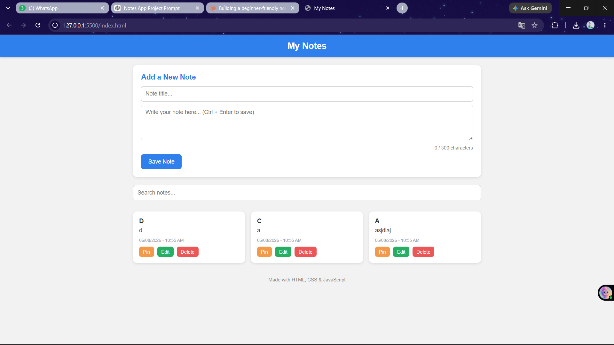

# My Notes - Simple Notes App

A simple, beginner-friendly Notes application built using **HTML, CSS, and Vanilla JavaScript**. This project was created as part of my web development learning journey to practice DOM manipulation, event handling, and using the browser's Local Storage.

## Description

My Notes is a single-page web app that lets you create, edit, delete, search, and pin notes. All notes are saved in the browser's Local Storage, so they stay even after you close or refresh the page. No frameworks or external libraries were used — everything is built with plain HTML, CSS, and JavaScript.

## Features

- Create a new note (title + content)
- Edit an existing note
- Delete a note (with a confirmation prompt before deleting)
- Search notes by title or content
- Pin / Unpin notes to keep important ones at the top
- Pinned notes are always sorted to the top of the list
- Notes are saved automatically using Local Storage (data persists after refresh)
- Empty state message shown when there are no notes
- Live character counter while typing a note (max 300 characters)
- Date and time shown on every note (updates when a note is edited)
- Keyboard shortcut: **Ctrl + Enter** to quickly save a note
- Fully responsive layout that works on mobile screens

## Technologies Used

- **HTML5** - Page structure
- **CSS3** - Styling (flexbox, grid, media queries)
- **JavaScript (Vanilla / ES6)** - App logic and DOM manipulation
- **Local Storage API** - To store notes in the browser

No frameworks, libraries, or CSS toolkits (like React, Bootstrap, Tailwind, or jQuery) were used in this project.

## Folder Structure

```
notes-app/
│
├── index.html          # Main HTML file (structure of the app)
├── style.css            # All the styling for the app
├── script.js             # JavaScript logic (add, edit, delete, search, pin, etc.)
├── favicon.svg           # Small icon shown in the browser tab
├── README.md             # Project documentation (this file)
└── screenshots/
      └── home.png        # Screenshot of the app
```

## How to Run

This project does not require any installation or build tools. Just follow these steps:

1. Download or clone this repository:
   ```
   git clone https://github.com/your-username/notes-app.git
   ```
2. Open the project folder.
3. Double-click on `index.html` (or right-click → "Open with" your browser).
4. That's it! The app will open in your browser and is ready to use.

You can also use a tool like the "Live Server" extension in VS Code for a better development experience.

## Screenshots

### Home Page




## Future Improvements

Here are some features I would like to add as I keep learning:

- Add categories/tags/labels to notes
- Add a light/dark theme toggle
- Add drag-and-drop reordering of notes
- Add note color options (like sticky notes)
- Add export notes as a text file or PDF
- Add undo option after deleting a note
- Sync notes with a backend database instead of only Local Storage
- Add pagination or infinite scroll for large numbers of notes

## Author

Made by a student learning frontend web development as a practice project.
